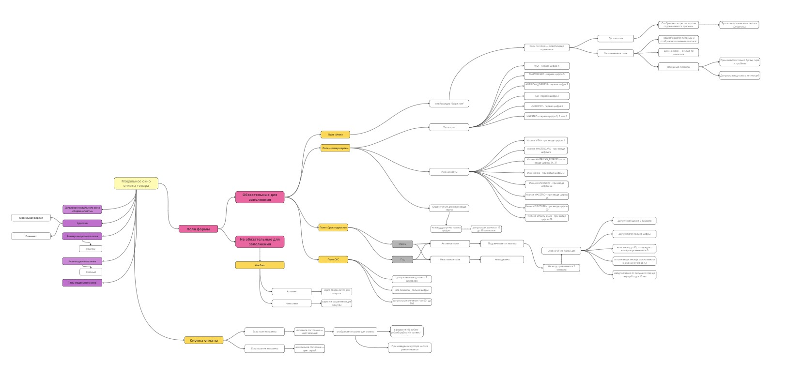

# Приветствую вас!

Меня зовут Елена, я опытный QA-инженер с более чем 3-летним опытом в тестировании ПО. Моя миссия — обеспечивать высокое качество продуктов через систематическое и всестороннее тестирование.

## Мои ключевые навыки

**Ручное тестирование:** 

**Тест-дизайн и тест-аналитика:**

Декомпозиция требований для формы оплаты.

**Обеспечение качества продукта:** 

**Инструменты и технологии:** 

## Мой опыт:

В моем портфолио включены успешные проекты по тестированию различных типов приложений, включая веб-сайты, ERP-проекты. Я также имею опыт работы в копирайтинге и управлении проектом.

**Мой подход:**

Я стремлюсь к постоянному обучению и совершенствованию своих навыков, чтобы быть в курсе последних тенденций в области QA. Мой подход к тестированию основан на комбинации автоматизации и ручного тестирования для достижения максимальной эффективности и полноты покрытия.

**Контакты:**

Готова к новым вызовам и открыта для возможностей сотрудничества. Если вы ищете профессионала, способного обеспечить высокое качество вашего продукта, свяжитесь со мной по адресу plotnikovaqa@gmail.com или по телефону +7(911) 591-77-90.

Благодарю за внимание, и я с нетерпением жду возможности внести свой вклад в успех вашего проекта!

С наилучшими пожеланиями,
Елена!